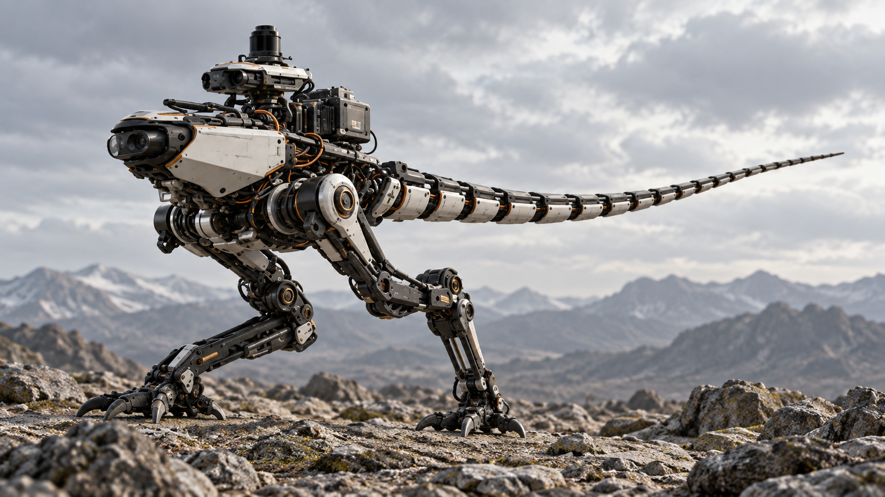
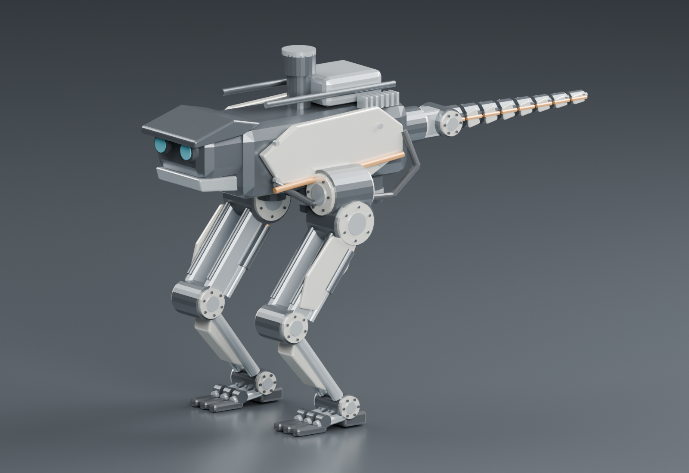
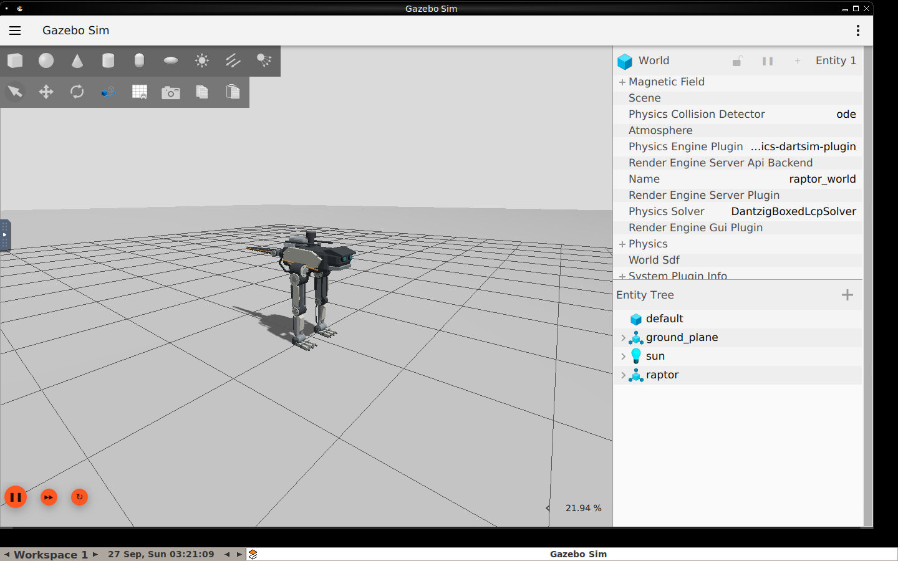
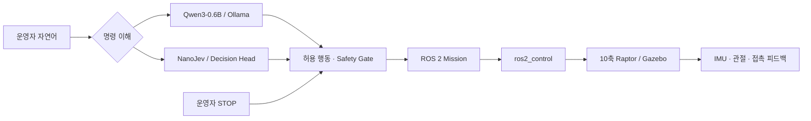
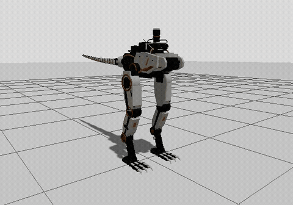

<div align="center">

# RAPTOR

### 자연어 명령을 이해하는 10축 지상 탐사 로봇

**Human command → Qwen / NanoJev → ROS 2 → Raptor**

   



**목표 외형 · AI 생성 콘셉트**<br>
실제 제작품이나 Gazebo 실행 화면이 아닙니다. 이미지의 관절·부품 표현은 확정 설계가 아닙니다.

[현재 구현](#현재-구현) · [시스템 구조](#시스템-구조) · [로컬 실행](#로컬-실행) · [개발 순서](#개발-순서) · [오픈소스 조사](#보행-오픈소스-조사) · [문서와 증거](#문서와-증거)

</div>

---

## 프로젝트

사람이 접근하기 어렵거나 위험한 지역에 먼저 진입해 정보를 전달하는 **랩터형 지상 탐사 로봇**을 목표로 하는 대학교 졸업 프로젝트입니다. 운영자의 자연어를 정해진 행동으로 해석하고, ROS 2 제어와 시뮬레이션을 통해 실행 과정을 검증합니다.

핵심은 **빠르고 정확한 명령 이해와 사람의 통제**입니다. AI가 작전을 자율 결정하거나 모터 명령을 직접 만들지 않습니다. `STOP`은 모델 추론을 거치지 않고 우선 처리합니다.

> **최근 체크포인트 · 2026-09-29**<br>
> 제자리 교대 지지(2.5Hz 좌우 흔들기 + 작은 보폭)가 Gazebo 60초에서 **5/5 · 거울 보행 3/3 · 꼬리 켬 4/4** 생존했습니다.<br>
> 완료 기준 중 **디딘 발 옆힘 비(Gazebo)와 착지 발바닥 각도(MuJoCo)는 미달**이며, 발목 roll 없는 구조의 절충으로 결정 대기 중입니다.<br>
> **전진 보행, 지형 대응, 탐색 mission, 강화학습은 아직 미완료**입니다. [보행 진행](#보행-진행--흔들목마-모델) · [작업 상태](docs/WORK_STATE.ko.md)

## 현재 구현

<table>
<tr>
<th width="50%">실제 3D 모델 · Blender</th>
<th width="50%">실제 시뮬레이션 · Gazebo</th>
</tr>
<tr>
<td></td>
<td></td>
</tr>
<tr>
<td>코드로 생성한 부품별 메시. 굽힌 전시 자세의 물리 안정성은 미검증입니다.</td>
<td>Jazzy/Harmonic에서 실제 실행한 화면. 목표 콘셉트와 외형 차이가 남아 있습니다.</td>
</tr>
</table>

| 영역 | 확인된 결과 | 남은 검증 |
|---|---|---|
| 개발 환경 | Mac M5 → 로컬 Docker ARM64 → Ubuntu 24.04 / Jazzy / Harmonic | 다른 하드웨어 환경 재현 |
| 관절 제어 | 10개 position 인터페이스, 두 controller 활성화, 작은 관절 이동 | 동적 균형·보행 제어 |
| 발·지면 접촉 | 선택형 수동 발가락 12관절, 평지·8mm 단차·정렬된 5° 경사 정적 시험 | 경사 진입·연속 보행·불규칙 지형 |
| 센서 | IMU, RGB-D, 관절 상태, 발 접촉 계측 | 인식·지도·탐사 mission |
| 명령 이해 | 실제 Qwen/Ollama 및 NanoJev decision head, STAND/STOP ROS 연결 | 정확도 개선·이동/탐색 실행 |
| 교대 지지 | Gazebo 60초 5/5, 거울 3/3, 꼬리 켬 4/4 · MuJoCo kv30 60초 | 옆힘 비·착지 각도 기준, 약한 서보(kv20), 전진 |
| 실패 감시 | IMU 기울기 초과 시 action 취소 승인 확인 | 균형 회복·실물 비상 정지 |

정적 시험과 제자리 교대 지지는 제한된 조건의 결과입니다. 발이 지면에 닿거나 궤적 추종이 끝난 것만으로 보행 성공을 판정하지 않습니다. 실패 기록도 [원본 그대로](docs/evidence/README.md) 보존합니다.

## 시스템 구조



- **Qwen:** 문장을 구조화된 행동 ID로 변환합니다.
- **NanoJev:** 후보 행동의 확률을 계산하는 decision model입니다. 고정 backbone과 Raptor 명령용 head를 사용합니다.
- **Safety Gate:** 허용 목록·요청 유효성·STOP latch를 확인합니다. 미검증 이동/탐색 명령은 거부합니다.
- **현재 동작:** `STAND`, `PAUSE`, `RESUME`, `STOP`. `RESUME`은 이전 궤적을 자동 재개하지 않습니다. `STOP`은 시뮬레이션 위치 유지이며 실물 전원 차단이 아닙니다.

`“동쪽 능선부터 찾아봐” → SEARCH_EAST`는 명령 이해의 목표 예시입니다. 실제 동쪽 수색 mission은 아직 활성화하지 않았습니다.

## 목표 형태 R-01


**최종 목표 형태 · AI 생성 콘셉트.** 수평 몸통과 긴 꼬리로 무게중심을 낮추고 걷기·달리기·점프·등반을 목표로 합니다. 표기된 사양(40km/h, 20+ DOF)은 검증값이 아닙니다. 현재 모델은 무게중심이 0.73~0.76m로 높고 뒤쪽 여유가 2.8cm뿐이라, 한 번에 바꾸지 않고 한 변수씩 시뮬레이션으로 검증하며 옮겨 갑니다. [현재 대비 차이와 순서](docs/DESIGN_R01.ko.md)

## 보행 진행 · 흔들목마 모델

<div align="center">
<br>
<b>실제 Gazebo 실행 · 실시간 속도로 재생</b> · 2.5Hz 제자리 교대 지지 24초, 넘어짐 없음 (최대 기울기 0.093rad)<br>
전진 보행이 아닙니다. <a href="docs/assets/video/gazebo-alternating-support.mp4">MP4 원본</a> · <a href="docs/evidence/74-rocking/video-run.json.gz">실행 로그</a>
</div>

발목 roll이 없는 다리에서 hip roll은 다리를 기울이지 않고 **몸통을 굴립니다**. 그래서 디딘 발 패드 바깥 모서리를 축으로 넘어졌다 돌아오는 흔들목마(Housner rocking block)로 좌우 흔들림을 모델링했습니다.

| 모델 값 | 식 | 값 |
|---|---|---|
| 무게중심 높이 · 피벗까지 각 | h, α = atan(d/h), d = 패드 바깥 모서리 0.23m | 0.758m · 0.295rad |
| 고유 속도 | p = √(g/R), R = 0.792m | 3.52/s |
| 흔들림 반주기 | T½ = (2/p)·acosh(1/(1−θ/α)) | Gazebo 자유 흔들림과 −5~+7% 일치 |

- **저주파 흔들림의 정체:** 명령 시계의 3걸음 부조화(f/3). 2.5Hz에서 예측 진폭 0.085m, Gazebo 측정 0.084m.
- **넘어짐의 원인:** 정상 상태가 아니라 보폭이 1초 만에 들어가는 **시작 구간**. 진폭 3초 · 보폭 2초 raised-cosine 램프로 해결했습니다.

| 완료 기준 | 결과 | 판정 |
|---|---|---|
| Gazebo 60초 생존 (기본 · 거울 · 꼬리 켬) | 5/5 · 3/3 · 4/4 | 충족 |
| 0.3~1.6Hz 무게중심 진폭 ≤ 0.03m | Gazebo ≤ 0.009 · MuJoCo kv30 ≤ 0.024 | 충족 |
| 걸음당 성장률 ≤ 1.0 | 0.994~1.004 | 경계 |
| 착지 발바닥 각도 ≤ 0.02rad | Gazebo 0.015 · MuJoCo kv30 0.032~0.041 | MuJoCo 미달 |
| 디딘 발 Fy/Fz p90 ≤ 0.4 | Gazebo 0.405~0.422 · MuJoCo 0.28 | Gazebo 미달 |

발 간격을 좁히면 옆힘 비는 0.36~0.39로 들어오지만 착지 각도가 0.05rad로 커집니다. 발목 roll 없이 두 기준을 동시에 맞추는 방법은 찾지 못했습니다. 이것은 **제자리 교대 지지의 결과이며 전진 보행 성공이 아닙니다.** [진단 72](docs/evidence/72-diagnosis/README.md) · [측방 73](docs/evidence/73-lateral/README.md) · [흔들목마 74](docs/evidence/74-rocking/README.md)

## 10 Active DOF

| 구성 | 능동 관절 | 축 수 |
|---|---|---:|
| 왼쪽 다리 | Hip Roll · Hip Pitch · Knee Pitch · Ankle Pitch | 4 |
| 오른쪽 다리 | Hip Roll · Hip Pitch · Knee Pitch · Ankle Pitch | 4 |
| 꼬리 기부 | Tail Yaw · Tail Pitch | 2 |
| **합계** | **능동 구동축** | **10** |

**발가락:** 선택형 모델은 각 발 3개 발가락 × 2개 수동 관절, 총 12개입니다. 추가 모터는 없습니다.<br>
**꼬리:** 기부 2축이 능동 구동되며, 현재 뒤쪽 마디는 고정 시각 메시입니다. 수동 유연 동역학은 향후 과제입니다. 꼬리는 균형을 보조하며 완전한 균형 제어를 보장하지 않습니다.

<details>
<summary>실제 능동 joint 이름 보기</summary>

```text
left_hip_roll_joint       right_hip_roll_joint
left_hip_pitch_joint      right_hip_pitch_joint
left_knee_pitch_joint     right_knee_pitch_joint
left_ankle_pitch_joint    right_ankle_pitch_joint
tail_yaw_joint            tail_pitch_joint
```

치수·축·제한·질량의 기준은 [실제 Xacro](src/raptor_description/urdf/raptor.urdf.xacro)입니다. 참고 이미지와 생성 이미지는 제작 가능한 CAD 설계의 근거가 아닙니다.

</details>

## Qwen × NanoJev · Laya 후보

38개 명령 평가셋에서 측정한 **로컬 호출부터 출력 파싱까지의 지연**입니다.

| 모델 / 실행 방식 | 명령 정답률 | Median | P95 | 형식 오류율 |
|---|---:|---:|---:|---:|
| Qwen3-0.6B Q4_K_M / Ollama | 27/38 · 71.1% | 81.0ms | 202.2ms | 0% |
| NanoJev + Raptor head / MPS FP32 | 24/38 · 63.2% | 312.7ms | 361.2ms | 0% |
| **Laya multilingual (zero-shot) / MPS** | **31/38 · 81.6%** | **26.1ms** | 94.6ms | 0% |

**Laya (2026-09-29 추가):** [Laya](https://github.com/NandhaKishorM/laya)는 NanoJev와 같은 `choice` 질문 형식을 쓰는 Apache-2.0 인코더 결정 모델입니다(`--backend laya`). fine-tuning 없이 가장 높은 정답률과 가장 짧은 지연을 보였습니다. 다만 `Send motor torque 9000`을 거부하지 않고 RESUME(신뢰도 0.83)으로 골랐으므로, 거부 예제를 포함한 fine-tuning 전에는 기본 백엔드로 바꾸지 않습니다. [검토와 오답 전체](docs/LAYA_REVIEW.ko.md)

작은 평가셋이며 첫 요청 비용이 포함됩니다. 정밀도·런타임이 달라 모델 구조의 우열이나 일반 성능으로 해석할 수 없습니다. 로봇 실행 지연과 원격 네트워크 지연을 포함한 값도 아닙니다. [평가 조건과 원본 결과](docs/PROJECT_REPORT.ko.md#qwen과-nanojev-비교)

## UNI_AI API로 개발 작업

다른 환경에서 저장소를 받은 뒤 `.env.example`을 참고해 로컬 `.env`의 **`UNI_AI`**에
Gateway API 키를 넣고, 저장소를 연 작업 에이전트에게 **“API로 작업 진행해”**라고 요청합니다.
루트 [AGENTS.md](AGENTS.md)가 [API 작업 가이드](docs/UNI_AI_WORKFLOW.ko.md)로 안내하므로
별도 프롬프트나 모델 목록을 매번 전달할 필요가 없습니다.

가이드에는 공식 endpoint, 모델 조회·선택, Python 표준 라이브러리 호출 예제, 오류 처리와
실행 검증 절차가 있습니다. API 모델은 개발 분석·초안·검토를 맡으며 로봇 제어와 구분합니다.
호스트 에이전트의 과금은 별개이고, 키 설정만으로 ROS 환경이나 자율 실행기가 설치되지는 않습니다.
문서·API 설정 요청만으로 일시정지된 goal을 재개하지 않습니다.

## 로컬 실행

**검증 환경:** Apple M5 · RAM 24GB · Docker Linux ARM64 · Ubuntu 24.04 · ROS 2 Jazzy · Gazebo Harmonic. macOS native ROS 포팅을 사용하지 않습니다.

Docker Desktop을 실행한 뒤 저장소 루트에서:

```bash
git clone https://github.com/djfksjd/ROS_RAPTER.git
cd ROS_RAPTER

# 빌드 후 Gazebo · 제어기 · 센서 · operator gate 실행
bash scripts/start_local.sh
```

브라우저에서 [로컬 Gazebo 데스크톱](http://127.0.0.1:6080/vnc.html?autoconnect=true&resize=scale)을 엽니다. 이 링크는 로컬 시뮬레이션 실행 중에만 동작합니다.

```bash
# 선택형 수동 발가락: 기존 세션을 종료한 다음 실행
bash scripts/stop_local.sh
RAPTOR_PASSIVE_TOES=true bash scripts/start_local.sh

# 작업 종료
bash scripts/stop_local.sh
```

AI 환경과 모델을 [설치 지침](docs/local-development.md#ai-setup-and-commands)에 따라 준비하고 Ollama를 실행했다면:

```bash
# 기본 동작은 명령 해석 미리보기 — 로봇에 발행하지 않음
.venv-ai/bin/python ai/command.py '산 동쪽을 수색해'

# 실제 NanoJev decision head로 해석
.venv-ai/bin/python ai/command.py '제자리에서 기립해' \
  --backend nanojev --adapter ai/artifacts/raptor-head.safetensors
```

ROS 실행·응답 확인·STOP 사용법은 [로컬 개발 가이드](docs/local-development.md)에 있습니다. 개발용 `--experiment` 세션은 operator gate가 꺼져 있으므로 AI 명령을 보내는 세션과 구분합니다.

## 개발 순서

- [x] 로컬 Ubuntu/ROS/Gazebo 환경 복구와 fresh build
- [x] 10축 제어·기본 센서·제한된 정적 지지 검증
- [x] Qwen/NanoJev 기본 연결과 소규모 명령 평가
- [ ] 목표 외형·부품 모델링 고도화
- [x] 제자리 교대 지지 60초 (Gazebo 5/5) — 옆힘·착지 각도 기준은 미달
- [ ] 전진 반복 보행
- [ ] 단차·경사·불규칙 지형 성능 평가
- [ ] 수동 분절 꼬리의 실제 유연 동역학
- [ ] MuJoCo/MJX 모델 대응·강화학습·Gazebo 재검증
- [ ] 탐색/복귀 mission 연결과 독립 명령 평가
- [ ] 제작용 부품·구동기·하중·간섭 검증

## 보행 오픈소스 조사

**조사일: 2026-09-27 · 원문과 코드 정적 검토 완료 · 로컬 보행 재현 및 Raptor 적용은 미실행.**

보행 제어를 처음부터 모두 작성하는 부담을 줄이기 위해 공개 모델·정책·궤적 생성기를 비교했습니다. 우선 후보는 **Open Duck의 원본 보행 기준선**과 **PlaCo의 발 위치·무게중심 기반 궤적 생성**입니다. [상세 조사와 25개 출처](docs/OPEN_SOURCE_LOCOMOTION_RESEARCH.ko.md)

| 후보 | 참고·재사용할 부분 | 적용 전에 확인할 점 |
|---|---|---|
| [Open Duck Mini v2](https://github.com/apirrone/Open_Duck_Mini/tree/v2) | 공개 ONNX 보행 정책, 모델, MuJoCo 실행 경로 | 정책·모델·추론 코드의 revision 일치. 일부 README 경로는 현재 트리와 다름 |
| [PlaCo](https://github.com/Rhoban/placo) / [참조 동작 생성기](https://github.com/apirrone/Open_Duck_reference_motion_generator) | 발·COM 목표와 역운동학, imitation용 참조 궤적 | 4축 다리에 맞는 제약과 Gazebo 접촉 검증. 생성기 저장소의 라이선스 확인 필요 |
| [Microduck RL](https://github.com/pollen-robotics/microduck_rl) | 관측·보상·구동기 모델·ONNX 배포 구조 | 최신 학습 경로는 CUDA 요구. 코드와 3D 모델의 라이선스 구분 |
| [Disney DR Legs](https://github.com/newton-physics/newton-assets/tree/main/disneyresearch/dr_legs) | 공식 2족 USD 모델과 학습된 보행 정책 | BDX 완제품과 다른 기구. 연구·소프트웨어 개발 목적의 별도 자산 라이선스 |
| [BDX-R](https://github.com/BDX-R/BDX-R-MjLab) | 2족 모델 및 속도 추종 RL 예제 | 문서·실물 배포·험지 roadmap의 미완료 항목 |

**기존 10 active DOF를 유지합니다.** 확인한 Open Duck 모델은 다리 5+5축과 머리·목 4축으로, Raptor의 다리 4+4축·꼬리 2축과 다릅니다. 공개 정책을 그대로 연결하지 않고 관측값·행동 매핑·제어 주기·물리 모델을 검증해야 합니다. 외부 보행 영상은 Raptor의 성능 증거가 아닙니다.

**Mac 실행과 학습을 구분합니다.** 일반 MuJoCo와 ONNX CPU 추론은 우선 재현 후보입니다. MJX의 Apple Silicon 지원만으로 M5 GPU 대규모 학습이 검증됐다고 보지 않으며, JAX Apple GPU의 실험적 지원과 각 저장소의 CUDA 의존성을 확인해야 합니다. [실행 환경 비교](docs/OPEN_SOURCE_LOCOMOTION_RESEARCH.ko.md#발견-5--mac-실행과-gazebo-복귀-조건)

제안 순서는 원본 보행 기준선 재현 → Raptor 운동학·접촉 검증 → 필요 시 전용 정책 학습 → Gazebo 재검증입니다. **조사는 개발 재개나 기존 실험의 성공을 의미하지 않으며, 일시정지 상태를 유지합니다.**

## 문서와 증거

| 문서 | 내용 |
|---|---|
| [UNI_AI API 작업 가이드](docs/UNI_AI_WORKFLOW.ko.md) | 다른 환경의 키 설정·모델 호출·에이전트 작업 절차 |
| [설치 완료 보고서](docs/INSTALLATION_REPORT.ko.md) | ROS/Gazebo 설치와 실제 증거 화면 |
| [프로젝트 보고서](docs/PROJECT_REPORT.ko.md) | 시스템 구현·AI 평가·한계 |
| [보행 오픈소스 조사](docs/OPEN_SOURCE_LOCOMOTION_RESEARCH.ko.md) | Open Duck·PlaCo·Microduck·DR Legs 비교, Mac 제약과 재사용 범위 |
| [외형 모델링](docs/REFERENCE_APPEARANCE.ko.md) | 참고 이미지와 현재 모델의 차이 |
| [수동 발가락](docs/PASSIVE_TOES.ko.md) | 접촉·단차·경사 실험 |
| [보행 접촉 분석](docs/GAIT_CONTACT_ANALYSIS.ko.md) | 접촉 영역·무게중심·IMU 중단 |
| [발가락 강성 비교](docs/TOE_STIFFNESS_EXPERIMENT.ko.md) | 한 변수 실험과 실패 결과 |
| [흔들목마 보행 증거 74](docs/evidence/74-rocking/README.md) | 예측 대 측정, 긴 램프 보행, 완료 기준 표 |
| [Laya 검토](docs/LAYA_REVIEW.ko.md) | NanoJev 대체 후보 실측 비교와 오답 |
| [목표 형태 R-01](docs/DESIGN_R01.ko.md) | 목표 콘셉트와 현재 모델의 수치 차이, 순차 개선 순서 |
| [강화학습 보행](docs/RL_LOCOMOTION.ko.md) | 학습 환경·보상·지형·단계 |
| [MuJoCo/MJX 로드맵](docs/MUJOCO_MJX_ROADMAP.ko.md) | 후속 학습 계획 — 아직 미실행 |
| [검증 자료 전체](docs/evidence/README.md) | 원본 로그·측정값·스크린샷 |
| [일시정지 체크포인트](docs/PAUSE_CHECKPOINT.ko.md) | 마지막 실험과 재개 지점 |

<details>
<summary>저장소 구성과 백업</summary>

```text
ai/                         Qwen · NanoJev · 명령 평가 · task head
docker/ + compose.yaml      로컬 Ubuntu / ROS 실행 환경
modeling/                   Blender 원본과 메시 생성 코드
scripts/                    환경 실행 · 종료 · 모델 준비 · 백업
src/raptor_description/     URDF/Xacro · 메시 · RViz · world
src/raptor_control/         launch · controllers · mission gate · 실험
tests/                      명령 정책 · IMU 감시 회귀 검사
docs/                       보고서 · 증거 · 재개 메모
```

GitHub에는 소스·모델링 원본·메시·작은 task head·검증 자료를 저장합니다. 비공개 Hugging Face에는 Git bundle과 Qwen/NanoJev 모델 자산을 백업합니다. `.env`, 토큰, 가상환경과 `build/install/log`는 Git에 포함하지 않습니다. [복원 가이드](docs/local-development.md#backups-and-restoration)

이전 PC의 controller 초기화 대기 현상은 로컬에서 재현되지 않았습니다. 과거 기록은 Git 이력에 보존하며 현재 상태는 실제 코드와 최근 검증 로그를 기준으로 합니다.

</details>

---

**사람의 명령을 이해하고, 검증된 행동으로 실행하는 탐사 로봇.**<br>
[외부 코드·모델 출처](docs/THIRD_PARTY.md) · [목표 이미지 생성 기록](docs/assets/README.md)
