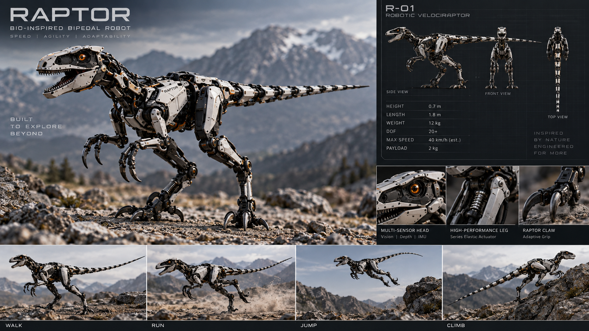

# 목표 형태 R-01과 현재 모델의 차이 — 순차 개선 계획 (2026-09-29)

사용자가 제시한 **최종 목표 형태**입니다. AI 생성 콘셉트이므로 표의 사양(40km/h, 20+ DOF 등)은
설계 근거가 아니라 방향입니다. 각 항목은 시뮬레이션으로 한 가지씩 바꿔 검증하고, 바로 전체를 바꾸지 않습니다.

## 현재 모델 측정값 대 목표

| 항목 | 현재 (MuJoCo 측정, 기본 웅크림 자세) | 목표 R-01 | 차이의 의미 |
|---|---|---|---|
| 전체 높이 | 1.07m (센서 마스트 포함), 몸통 중심 0.96m | 0.7m | 몸통이 높게 떠 있음 |
| 무게중심 높이 | **0.73~0.76m** | (추정) 0.45~0.5m | 높을수록 흔들목마 각 α가 작아져 옆으로 넘어지기 쉬움 |
| 무게중심 앞뒤 위치 | 접촉 영역 뒤끝까지 **2.8cm**, 앞끝까지 26cm (2초 정지 후) | 발 중앙 위 | **작은 교란에도 뒤로 넘어져 꼬리가 닿음** (RL 탐색 잡음 0.1에서 약 1초) |
| 질량 | 17.3kg (몸통 8kg) | 12kg | 같은 구동기로 가속 여유 증가 |
| 전체 길이 | 1.71m | 1.8m | 비슷함 |
| 앞쪽 질량 | 머리·목 없음 | 머리·목이 앞으로 뻗음 | 꼬리와 균형을 이루는 구조가 없음 |
| 발 간격 | 0.36m | 좁음 (콘셉트 정면도) | 좁으면 지지 전환이 쉬움. 흔들목마 피벗도 바뀜 |
| 다리 | 4축, 속도 한계 2~3rad/s | 긴 발허리뼈, 직렬 탄성 구동기(SEA) | 달리기·점프는 속도 한계가 병목 ([증거 75](evidence/75-feasibility/README.md)) |
| 능동축 | **10** | 20+ | 증가는 사용자 결정 사항 (아래) |
| 최고 속도 | 측정 없음 | 40km/h (추정치로 표기됨) | 12kg 2족에서 검증된 값이 아님. 현실 목표는 측정 후 설정 |

## 순서 (한 번에 한 변수, 매 단계 같은 지표로 측정)

지표: 정적 여유(앞·뒤·옆), 무게중심 높이, 흔들목마 반주기, 점프 상한, 같은 설정의 RL 평지 보행(넘어짐 비율·속도 추종).

1. **기준선** — 현재 모델의 지표와 RL 평지 보행 결과 (진행 중).
2. **구동기 속도 사양** — 형상은 그대로 두고 관절 속도 한계만 바꿉니다(승인됨).
   [증거 75](evidence/75-feasibility/README.md) 측정: 토크가 아니라 **속도가 병목**입니다. 현재 사양으로는 점프 이륙이 없고,
   보행은 추정 0.5~0.6m/s가 상한입니다. 권고안 `r01a`(가상 구동기): hip roll 5, hip pitch 11, knee 18, ankle 10rad/s, 토크 한계는 그대로입니다.
   이 사양이면 무릎 12rad/s(4배)에서 약 6cm, 18rad/s(6배)에서 약 22cm 점프가 물리적으로 가능합니다(착지 제어 없음).
   실제 부품(QDD 계열)은 데이터시트로 확인해야 하며 아직 확인하지 않았습니다.
3. **무게중심 앞뒤 위치** — 머리·목 질량을 앞으로, 꼬리를 균형추로 씁니다. 뒤로 넘어지는 문제의 직접 원인입니다.
4. **무게중심 높이** — 몸통과 엉덩이 높이를 낮추고 다리 분절 길이를 조정합니다.
5. **발 간격과 발 길이** — 좁은 발 간격, 앞뒤로 긴 발가락 지지.
6. **질량 12kg** — 부품별 질량 예산.
7. **능동축 증가(선택)** — 발목 roll 또는 목 관절. 사용자가 명시적으로 결정해야 합니다.

각 단계는 MuJoCo 설계 변형으로 먼저 비교합니다. 채택한 변경만 기준 Xacro에 반영해 Gazebo에서 다시 검증합니다.
