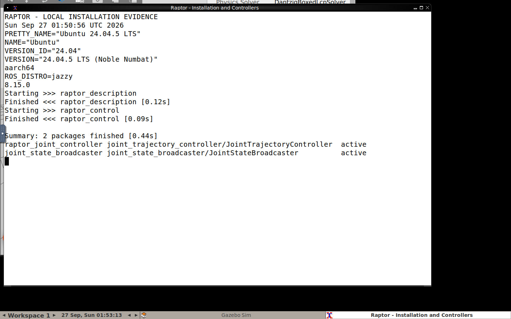
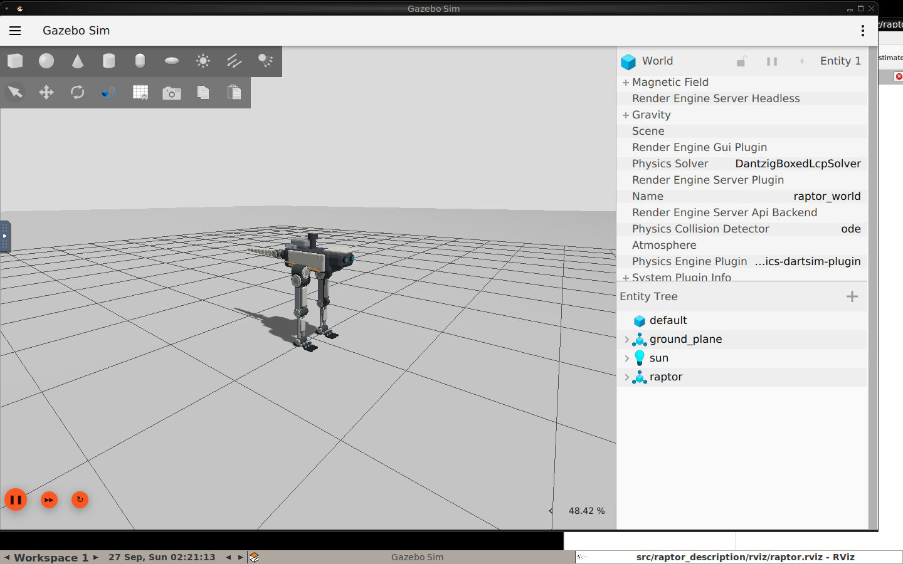
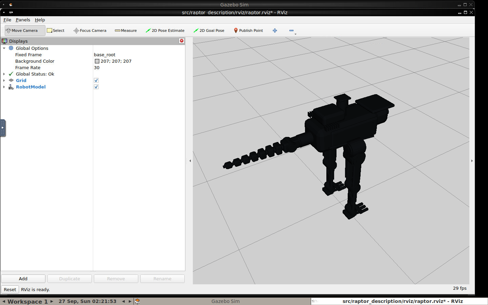

# ROS 2와 Gazebo 실제 설치 완료 보고서

검증일: 2026-09-27. 아래 내용은 이 Mac에서 실제 실행한 결과다.

## 실행 환경

| 항목 | 확인값 |
|---|---|
| 호스트 | MacBook Pro Mac17,2 / Apple M5 / RAM 24GB |
| 호스트 OS | macOS 26.4.1 / arm64 |
| Ubuntu | Docker Desktop 내부 Ubuntu 24.04.5 LTS / aarch64 |
| ROS | ROS 2 Jazzy |
| Gazebo | Harmonic / Gazebo Sim 8.15.0 |
| controller_manager | 4.48.0 |
| gz_ros2_control | 1.2.20 |
| ROS 컨테이너 제한 | CPU 4개 / RAM 4GiB |

macOS native ROS를 설치하지 않았다. 기준 Ubuntu 환경을 기존 Docker의 Linux
가상화 환경에서 재현했다. Gazebo GUI는 컨테이너의 Xvfb·Mesa 소프트웨어 렌더링을
사용하며, Mac 브라우저에서 localhost noVNC로 확인했다.

## 설치·빌드·제어 확인 화면



원본: [설치·빌드 로그](evidence/installation.txt).

1. `raptor_description`, `raptor_control` 두 패키지 fresh build 성공.
2. Xacro 생성 및 `check_urdf` 성공. 루트는 `base_root`.
3. active joint 10개와 ros2_control joint 목록 일치.
4. Gazebo entity 생성 성공, hardware interface 조회 성공.
5. `joint_state_broadcaster`, `raptor_joint_controller` 모두 active.
6. ROS `/clock`, `/joint_states`, IMU, RGB-D 및 양발 contact 수신.



이 화면은 Blender 렌더가 아니라 실제 Gazebo GUI 캡처다.
별도 [Blender 외형 참고 렌더](evidence/raptor-concept-render.png)는 물리 실행 증거로 사용하지 않는다.



RViz에서 TF와 RobotModel 표시를 확인했다. 현재 RViz의 상세 메시가 어둡게 표시되는
재질 표현 문제는 남아 있으며, Gazebo의 색상 표시와 구분한다.

## 재현

Docker Desktop 실행 후 프로젝트 루트에서:

```bash
bash scripts/start_local.sh
```

브라우저: `http://127.0.0.1:6080/vnc.html?autoconnect=true&resize=scale`

```bash
docker exec raptor-dev /ros_entrypoint.sh ros2 control list_controllers
docker exec raptor-dev /ros_entrypoint.sh ros2 control list_hardware_interfaces
bash scripts/stop_local.sh
```

스크립트는 기존 `raptor-dev`가 있으면 덮어쓰지 않는다. 새 세션이 필요할 때만
stop 후 start한다. STOP latch도 세션 재시작으로 초기화되므로 운영자 의도 없이
재시작하지 않는다. 다른 프로젝트의 Docker 컨테이너나 볼륨은 삭제하지 않는다.

## 확인 범위와 한계

- 이전 PC의 controller 초기화 대기는 이번 환경에서 재현되지 않았다. 과거 원인을
  규명했다고 주장하지 않는다.
- 저장된 옛 URDF의 절대 경로 대신 현재 환경에서 Xacro를 생성해 사용한다.
- 설치 완료와 안정적인 보행 완료는 별개다. 보행은 아직 개발 중이다.
- 소프트웨어 렌더링과 다른 호스트 작업 때문에 실제 시간 대비 시뮬레이션 속도는
  변한다. real-time factor 1을 보장하지 않는다.
- GUI는 Mac localhost에만 노출한다. 원격 인터넷 제어 서버가 아니다.

공식 근거: [ROS Jazzy](https://docs.ros.org/en/jazzy/),
[gz_ros2_control](https://control.ros.org/jazzy/doc/gz_ros2_control/doc/index.html),
[Gazebo 센서](https://gazebosim.org/docs/harmonic/sensors/).
