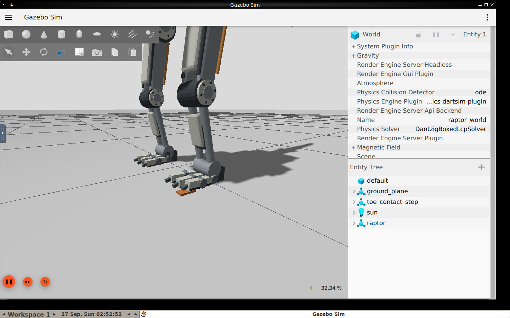
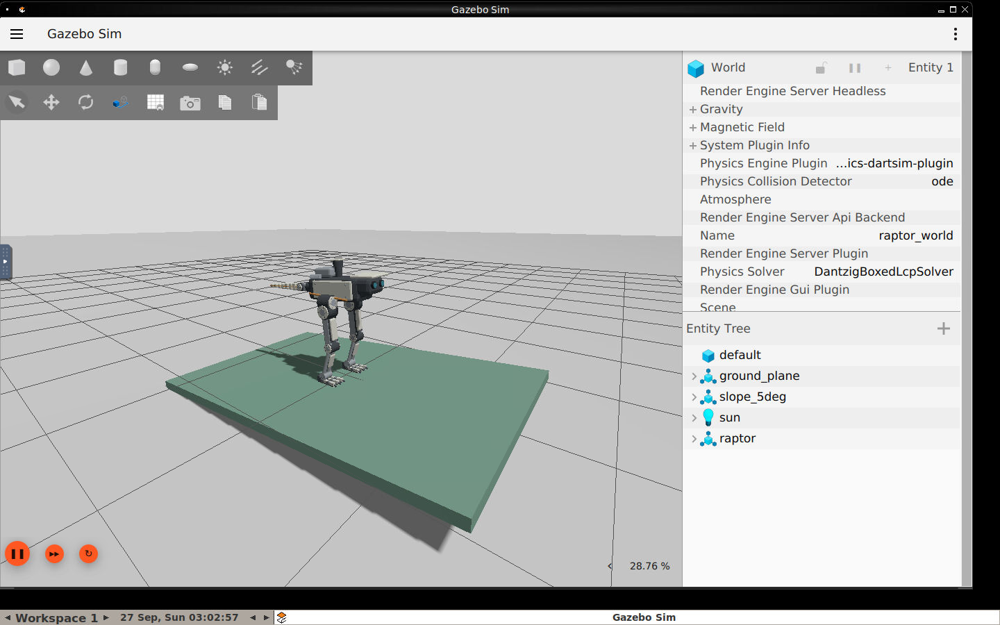

# 수동 발가락 관절 및 접촉 시험

## 구조와 범위

`feature/passive-toes`에서 기존 로봇에 옵션으로 추가했다. 기본 모델은 유지한다.
양발 각각 앞쪽 발가락 3개, 발가락마다 proximal/distal 굽힘 관절 2개다.
기존 **10 active DOF + 12 passive joints**이며 발가락 모터·전송·command interface를
추가하지 않았다. 다리당 총 foot assembly 질량 0.6kg, 전체 질량 17.3kg을 유지했다.

각 관절에는 회전 제한(-0.55~0.65rad), 감쇠, torsion spring을 적용했다.
근위/원위 강성 12/8Nm/rad, 감쇠 0.08은 시뮬레이션 시험값이며 실제 부품 선정값이 아니다.
3개 발가락을 약간 벌려 배치하고 별도 collision과 contact sensor를 사용한다.
기존 큰 foot collision box는 작은 뒤꿈치 collision과 각 마디 collision으로 교체한다.
끝 발톱은 외형이며 지면을 파거나 암벽에 걸리는 효과를 구현하지 않았다.
실제 랩터 해부학을 정확하게 복제한 모델이나 제작 가능한 완성 설계라고 주장하지 않는다.

[모델 계약 검사](evidence/22-passive-toes-contract.txt): active joint 축/제한 유지,
12개 수동 관절이 ros2_control에서 제외됨, SDF spring 보존, 양의 관성 및 질량 합계 확인.
[공식 URDF 확장 문서](https://sdformat.org/tutorials/specification/sdformat_urdf_extensions/)의
`springReference`/`springStiffness`를 사용하고 실제 변환 결과를 검사했다.

## 실제 결과

| 시험 | 결과 |
|---|---|
| 짧은 뒤꿈치의 첫 모델 | [뒤쪽으로 기울어 실패](evidence/15-passive-toes-short-heel-failure.json). 기존 대비 후방 지지 범위가 15mm 줄어든 것을 확인 |
| 뒤꿈치 후방 범위 복구 | [평지 neutral 기립 통과](evidence/16-passive-toes-flat-standing.json) |
| 평지 발가락 접촉 | [12개 수동 각도와 분리된 접촉 확인](evidence/17-passive-toes-flat-contact.json) |
| 8mm 단차, 다리를 편 자세 | [실패](evidence/18-passive-toes-step-contact.json) |
| 동일 단차, hip -0.15 / knee 0.4 / ankle -0.25rad | [5초 정적 관찰 통과](evidence/19-passive-toes-step-crouch-contact.json). 발가락 1의 두 관절이 약 -3.30° / -3.02° 변형 |
| 5° 경사, 기존 자세로 낙하 | [실패](evidence/21-passive-toes-slope5-contact.json) |
| 5° 경사, hip -0.05 자세로 낙하 | [앞으로 기울어 실패](evidence/23-passive-toes-slope5-forward-contact.json) |
| 5° 경사, 위 자세를 경사와 정렬해 지면 가까이 배치 | [5초 정적 관찰 통과](evidence/24-passive-toes-slope5-aligned-contact.json). 경사 진입·낙하 회복 시험이 아님 |
| 더 높은 발 들기 | [몸체 회전 0.25rad 기준 초과로 실패](evidence/28-passive-toes-higher-lift-test.json). 양발 접촉도 지속 |
| 평지 6단계 발 들기 궤적 | [궤적은 완료했으나 양발 접촉 지속](evidence/26-passive-toes-gait-test.json). 보행 성공 아님 |



단차와 닿은 발가락에 별도 모터 명령을 보내지 않았다. 해당 발가락의 독립적인
각도 변화와 `toe_contact_step`과의 실제 collision pair를 로그에서 확인했다.
19번 이후 `raw_body1_force_z`는 Gazebo contact message의 body-1 wrench 원시값이다.
접촉 순서·기준에 따라 부호가 달라져 이를 곧바로 발의 순수 수직 지지력으로 합산하지 않는다.
이전 파일의 `force_z`도 같은 원시값이며 ground reaction force 정규화를 완료한 값이 아니다.

## 피드백 및 IMU 수정

Gazebo의 수동 관절 publisher와 ros2_control broadcaster가 `/joint_states`에 서로
다른 joint subset을 발행한다. 수동 subset이 기존 10축 피드백을 덮어쓰지 않도록
완전한 active subset일 때만 제어 피드백과 freshness를 갱신한다. 회귀 테스트를 추가했다.
RViz/robot_state_publisher는 두 subset을 받아 각각의 TF를 갱신한다.

기존 Gazebo IMU의 기본 참조는 생성 당시 방향이다. 5° 기울여 생성한 모델에서
IMU pitch 약 0°, 실제 model pose pitch 약 -5°였던 차이를 확인했다.
[Gazebo Imu 시스템 소스](https://github.com/gazebosim/gz-sim/blob/gz-sim8/src/systems/imu/Imu.cc)의
초기 reference 설정을 확인하고 `<orientation_reference_frame><localization>ENU`를
명시했다. 24번까지의 기록은 이전 참조 설정이다.
[27번 재검증](evidence/27-passive-toes-slope5-world-imu.json)에서는 IMU pitch
-5.00006°가 model pose와 일치하고 5초 정적 관찰도 통과했다.



## 실행

평지에서 수동 발가락 외형과 operator gate를 실행:

```bash
bash scripts/stop_local.sh
RAPTOR_PASSIVE_TOES=true bash scripts/start_local.sh
```

단차 접촉 연구 세션 (operator mission gate를 실행하지 않음):

```bash
bash scripts/stop_local.sh
bash scripts/start_local.sh --experiment passive_toes:=true crouched_start:=true \
  world_file:=/raptor_ws/src/raptor_description/worlds/toe_contact_test.sdf
docker exec raptor-dev /ros_entrypoint.sh python3 src/raptor_control/scripts/toe_contact_probe.py
```

정렬된 5° 경사 연구 세션:

```bash
bash scripts/stop_local.sh
bash scripts/start_local.sh --experiment passive_toes:=true crouched_start:=true \
  crouch_hip_pitch:=-0.05 spawn_pitch:=-0.08726646 spawn_z:=-0.01636 \
  world_file:=/raptor_ws/src/raptor_description/worlds/slope_5deg_test.sdf
```

`spawn_z`는 접촉면 가까이에 놓기 위한 초기 조건이다. world 고정 joint가 아니며
중력·충돌은 활성 상태다. 급경사 최대 등판각을 뜻하지 않는다.
측정 도구는 `/raptor_ws/log/toe-contact-probe.json`에 기록한다.
프로브 실행 명령에 따라 원본이 덮어써지므로 실험별로 `docker cp`해 보존한다.

## 남은 검증

- 한발 지지 중의 자세 제어와 실제 toe/heel 이탈 및 착지 확인.
- 접촉 힘을 일관된 기준으로 정규화하고 지지 영역·미끄럼을 계산.
- 충분한 반복과 다양한 마찰·단차·경사 조건에서 보행 평가.
- 발톱 곡률·패드·힌지·스프링·힘줄 등의 부품 설계와 하중/내구성 검토.
- [MuJoCo·MJX 강화학습 후속 작업](MUJOCO_MJX_ROADMAP.ko.md).

발가락 관절 추가와 제한된 정적 접촉 시험은 완료했지만, 험지·급경사 보행을
완성한 상태는 아니다. 현재 미검증 gait는 operator mission에서 계속 차단한다.
