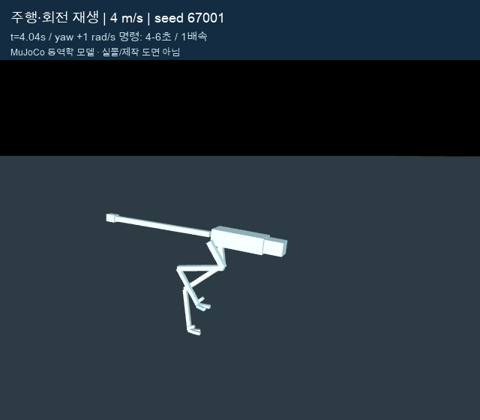
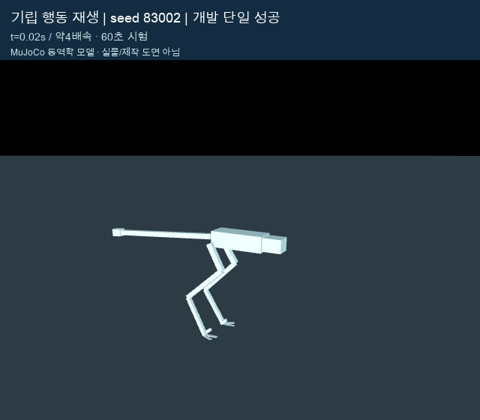
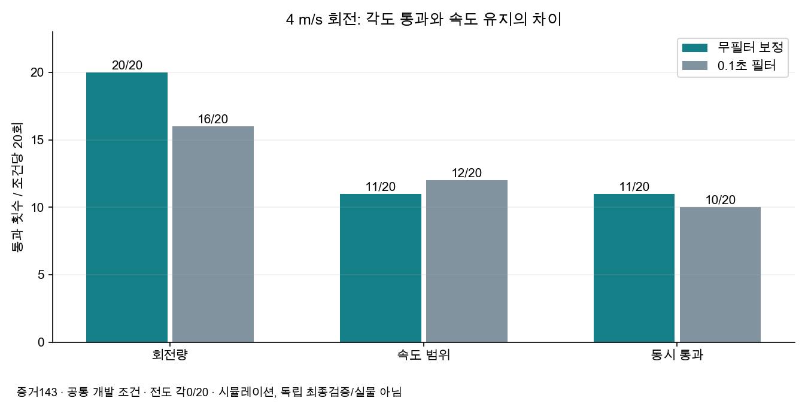
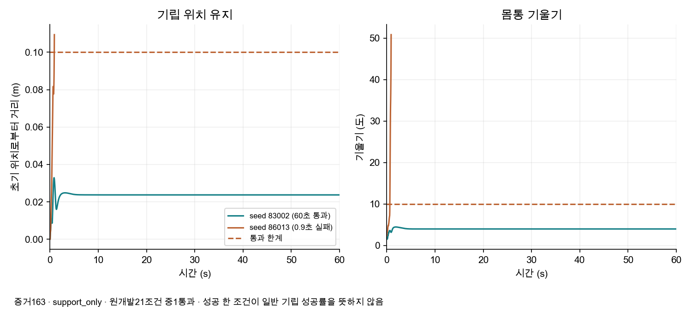
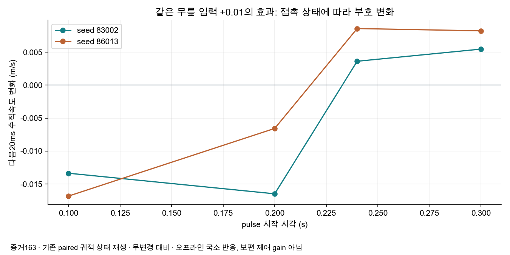
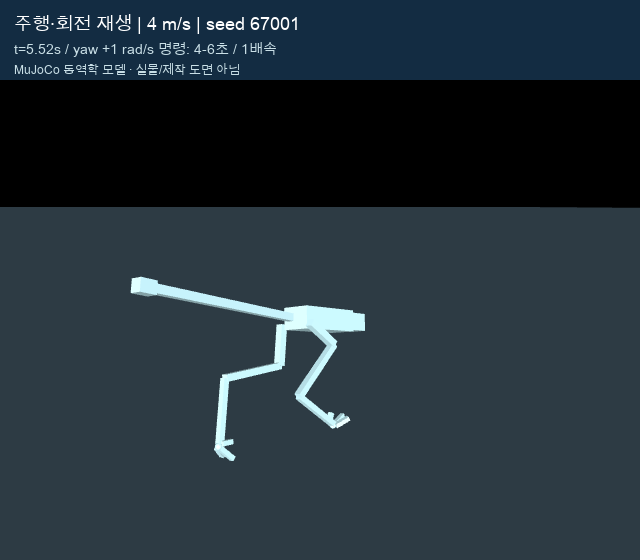
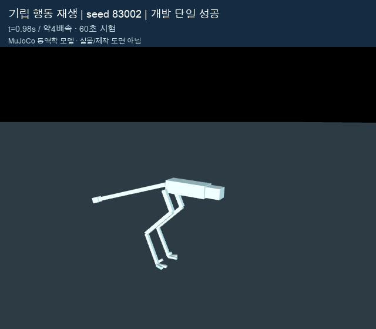
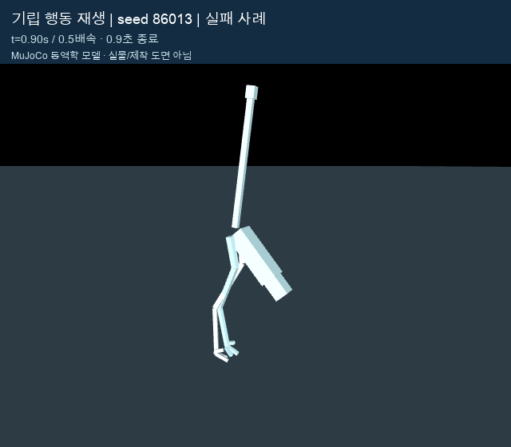

# 최신 시뮬레이션 시각자료 - 2026-10-09

증거143·163과일시정지체크포인트의기존조건을시각화했다. 새학습/새독립평가를시작하지않았다. 동역학/충돌모델의실제MuJoCo렌더이며실물사진·제작도면·AI생성이미지가아니다. 가독성을위해재질색과조명만변경했다.

## 시뮬레이션 영상

|자료|조건과확인범위|영상|
|---|---|---|
|주행·회전|작업정책131,seed67001,4m/s,yaw+1rad/s를4-6초명령,10초재생·1배속. 증거143해당결과와정확일치. 회전구간속도3.609-4.226m/s,해당한조건은각도/속도통과지만전체개발군은11/20동시통과.|[MP4](run-turn-4mps.mp4)|
|기립단일성공|증거163 support_only,seed83002,60초·약4배속. 원저장3,000행위치/기울기/비행정확일치. 원개발21조건중성공1개이며일반기립성공을뜻하지않음.|[MP4](stand-83002.mp4)|
|기립실패|같은조건군seed86013,0.9초종료·0.5배속. 원저장45행정확일치. 실패도함께공개.|[MP4](stand-86013.mp4)|

### README용짧은미리보기

## 최신그래프

증거143의20개공통개발조건대조. 무필터20/11/11,필터16/12/10. 양쪽전도0이지만통합목표미달.

증거163의support_only원시행. 주황선은0.9초종료후추가로연장하지않았다. 한계선은이동0.1m/기울기10도이며전체기립에는비행0·60초·last40가상부하도필요하다.

같은+.01normalized무릎pulse의무변경대비다음20ms수직속도차이. 접촉상태별부호변화이며보편적인제어gain또는실물결과가아니다.

## 실제렌더스냅샷

|주행·회전|기립성공|기립실패|
|---|---|---|
||||

## 재생성·검증

Mac에서기존.venv-sim,checkpoint복원파일,시스템ffmpeg,Arial Unicode폰트를사용해 `.venv-sim/bin/python docs/assets/latest/build_latest.py`로재생성한다. video는기존행동/평가조건재생이므로명시적시각화요청이있을때만실행한다. 스크립트는원결과일치assert후verification.json에원시조건·프레임수·SHA256을기록한다. 전체시뮬레이션코드검사는paused체크포인트의154개통과기록을참조하고시각자료제작에서재실행했다고보고하지않는다.
