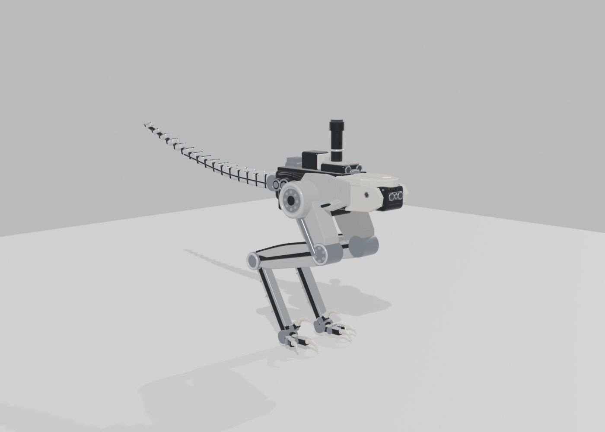
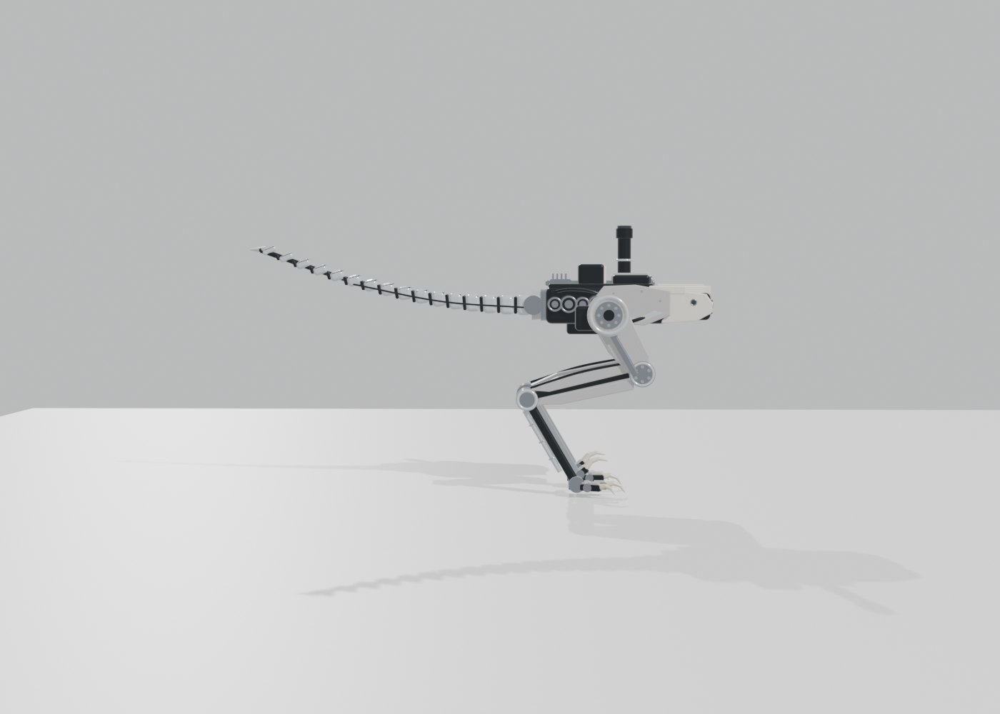
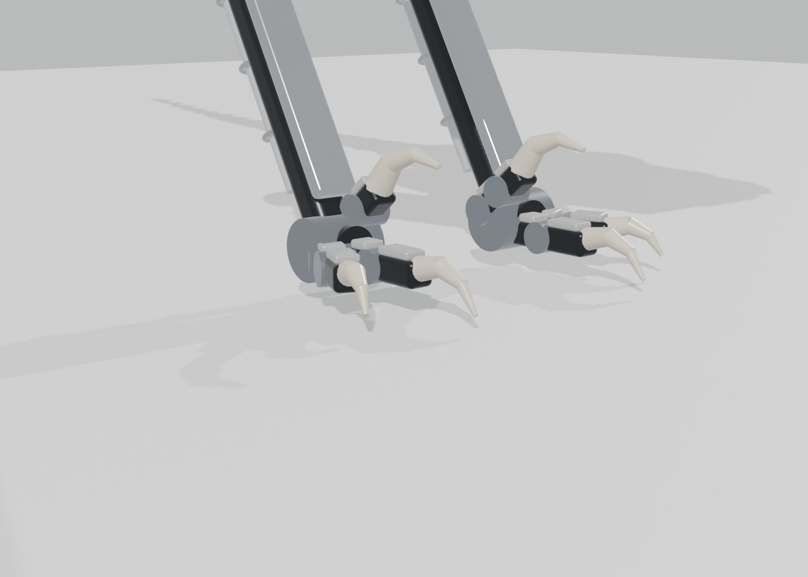

# 84 — R-02 모델링 정비: 단일 원천 경로, 목표 형태, 외형 메시 (2026-09-29)

사용자 지시: "모델링부터 완벽하게". 목표 형태는 사용자의 참고 이미지(`raptor-views`, AI 생성)입니다.
- 목 없음
- 몸통 앞에 센서 포드, 위에 센서 마스트
- 골반에 큰 드럼 구동기
- 발톱 달린 발가락
- 16마디 꼬리

참고 이미지는 저장소에 넣지 않았습니다. 이전 README의 R-02 목 막대는 제가 임의로 넣은 시각 요소였고, 목표 형태와 달라 없앴습니다.

## 1. 단일 원천 경로 (모든 시뮬레이터가 같은 값)

```
modeling/design_r02.py  →  src/raptor_description/config/r02_design.yaml  (링크별 질량·무게중심·관성, 관절 한계, 발가락·스프링)
  →  src/raptor_description/urdf/raptor_r02.urdf.xacro  →  URDF  →  sim/build_model.py  →  sim/raptor_r02.xml (+ _achilles)
  →  Gazebo·RViz: sim.launch.py leg_design:=r02
외형: modeling/morphloom/raptor_r02_parts.py → morphloom build → split_links.py (Blender) → meshes/r02/*.glb (25개)
```

한 명령(`.venv-sim/bin/python modeling/build_r02.py`)이 YAML·URDF·MuJoCo 모델을 모두 다시 만듭니다.
이전에는 `build_r02.py`가 MuJoCo 모델을 직접 만들어 Gazebo와 경로가 달랐습니다.
그 모델은 `sim/raptor_r02_v1.xml`로 보존합니다. 증거 83의 R-02 단계 A·B가 그 모델로 학습됐습니다.

## 2. 형태 변경 (계산기 반영)

| 항목 | 이전(v1) | 현재 |
|---|---|---|
| 앞쪽 질량 0.45kg | 몸통 앞 0.42m에 떠 있는 '머리' | **몸통 앞 센서 포드**(몸통 끝 + 0.07m) |
| 컴퓨터·센서 0.5kg | 몸통 | 컴퓨터 0.3kg(몸통) + **센서 마스트 0.2kg**(위 0.14m) |
| 꼬리 pitch 범위 | ±0.6rad | **±0.8rad** (40km/h 사양서의 피치 보정 계산 대비) |
| 기본 자세 (엉덩이 / 무릎 / 발목) | −0.538 / 1.88 / −1.88 | −0.527 / 1.876 / −1.876 |
| 꼬리/몸 피치 관성비 | 0.68 | 0.72 |

총질량 11.36kg은 같습니다. 무게중심은 발가락 뿌리 앞, 발가락 III 끝 뒤에 있습니다(시험으로 확인).

## 3. 검증

- **기존 모델 회귀 없음:** 도구를 바꾼 뒤 기존 12축 모델의 URDF와 MuJoCo 파일이 **바이트 단위로 같음**을 확인했습니다.
  바꾼 도구는 `generate_urdf.sh`의 Xacro 파일 선택, `build_model.py`의 스프링 기준각·링크별 마찰·가벼운 링크 armature, 구 모양 충돌체 처리입니다.
- **R-02 계약 시험** `tests/test_r02_model.py` 5개 통과
  - YAML이 계산기와 일치
  - 질량이 설계값과 같음
  - 12축 구동기 이름·순서·한계
  - 기본 자세에서 발가락 III·IV 수평, 무게중심이 발가락 위
  - 발가락 스프링과 아킬레스 스프링 기준각
- 기존 RL·정책 실행기·모델 계약 시험도 함께 통과했습니다(18개).
- **URDF 경로 모델 vs 직접 생성 v1**
  - 관절·구동기·발가락 스프링·총질량이 같습니다.
  - 기존 B 정책으로 서고 걸으며 넘어지지 않았습니다.
  - 발가락 III 하중 55%, IV 12~14%, 패드 32~33%입니다.
- **Gazebo Harmonic** (`start_local.sh --experiment leg_design:=r02`)
  - 모델 로드, 위치 명령 인터페이스 12개 점유, 두 제어기 active, 오류 없음
  - 고정대(test_fixture)에서 기본 자세를 정확히 유지(−0.5271 / 1.8762 / −1.8762)
  - 수동 발가락 상태를 `/joint_states`에 병합(브리지 조건에 r02 추가), IMU 수신
  - 자유 스폰에서 정책 없이 앞으로 넘어짐(pitch 1.02rad). MuJoCo와 같은 결과로, 발가락으로 서는 몸은 능동 균형이 필요합니다.
- **외형:** morphloom review-pass(차단 없음, `morphloom-run-report.json`)입니다.
  - 280개 부품, 링크 25개, GLB 7.8MB
  - 치수 계약: 발등뼈 지지대 294.4mm, MTP 패드 지름 36mm, 몸통 400mm
  - `detailed_visuals:=true` URDF가 참조하는 GLB 25개가 모두 있습니다.

| 3/4 시점 | 옆모습 | 발 |
|---|---|---|
|  |  |  |

Blender 렌더(기본 자세, 평지)입니다. **시각 외형이며 제작용 CAD가 아닙니다.**
- 다리는 설계 질량 예산(가벼운 관·벨트 구동)에 맞춰 참고 이미지보다 가늘게 두었습니다.
- 발톱의 지면 파고들기는 시뮬레이션하지 않습니다(점 접촉 마찰만).

## 한계와 다음
- Gazebo에서 상세 GLB 외형 표시(RViz 포함)는 아직 화면으로 확인하지 않았습니다. 경로·파일 존재만 확인했습니다.
- R-02 정책을 최종 모델에 맞춰 이어 학습 중입니다(r02C). 증거 83의 A·B는 v1 모델 결과입니다.
- 다음 작업: 40km/h 요구 사양서(`docs/design/40kmh-spec.md`)와 T1 달리기 학습
